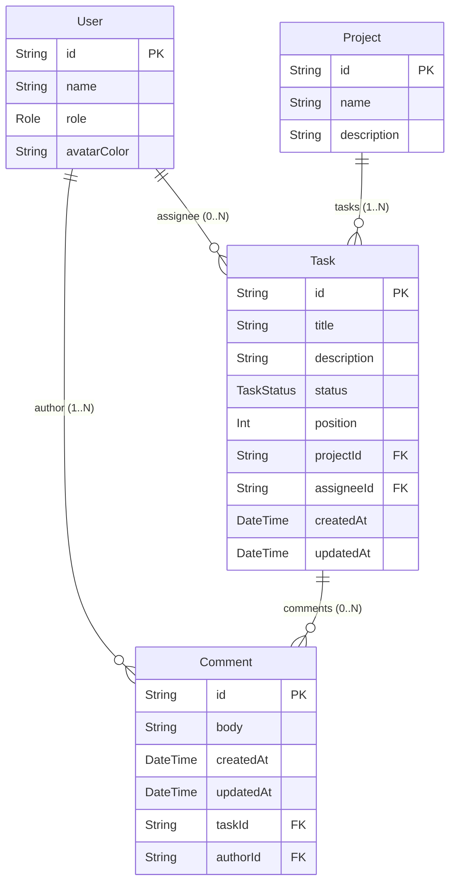

# Data Model: Taskify 作成

**Feature**: 001-create-taskify
**Date**: 2026-02-24
**Source**: [spec.md](spec.md) Key Entities + [research.md](research.md) §3 Prisma

---

## Entity Relationship Diagram



## Entities

### User（ユーザー）

アプリケーションの利用者。事前定義された 5 名（PM 1 名 + エンジニア 4 名）で構成される。

| Field | Type | Required | Description |
|-------|------|----------|-------------|
| id | String (CUID) | ✅ | 一意識別子（自動生成） |
| name | String | ✅ | ユーザー名（例: "田中 太郎"） |
| role | Role (enum) | ✅ | 役割（PRODUCT_MANAGER / ENGINEER） |
| avatarColor | String | ✅ | アバターの表示色（例: "#3B82F6"） |

**Relationships**:
- `tasks[]`: このユーザーに割り当てられたタスク一覧（1:N）
- `comments[]`: このユーザーが作成したコメント一覧（1:N）

**Validation**:
- `name`: 1〜100 文字
- `role`: `PRODUCT_MANAGER` または `ENGINEER` のいずれか

**Notes**:
- 初期フェーズでは CRUD 不要（シードデータで投入）
- `avatarColor` はユーザー選択画面のアバター表示に使用

---

### Project（プロジェクト）

タスクを束ねる単位。サンプルとして 3 つが事前定義される。

| Field | Type | Required | Description |
|-------|------|----------|-------------|
| id | String (CUID) | ✅ | 一意識別子（自動生成） |
| name | String | ✅ | プロジェクト名（例: "Taskify v1.0 開発"） |
| description | String? | ❌ | プロジェクトの説明 |

**Relationships**:
- `tasks[]`: このプロジェクトに所属するタスク一覧（1:N）

**Validation**:
- `name`: 1〜200 文字

**Notes**:
- 初期フェーズでは CRUD 不要（シードデータで投入）
- 全ユーザーがすべてのプロジェクトにアクセス可能（権限管理なし）

---

### Task（タスク）

作業の最小単位。かんばんボード上でカードとして表示される。

| Field | Type | Required | Description |
|-------|------|----------|-------------|
| id | String (CUID) | ✅ | 一意識別子（自動生成） |
| title | String | ✅ | タスクのタイトル（例: "ログイン画面のデザイン"） |
| description | String? | ❌ | タスクの詳細説明 |
| status | TaskStatus (enum) | ✅ | 現在のステータス |
| position | Int | ✅ | カラム内での表示順序（0 始まり） |
| projectId | String (FK) | ✅ | 所属プロジェクトの ID |
| assigneeId | String? (FK) | ❌ | 担当者の ID（未割り当ての場合 null） |
| createdAt | DateTime | ✅ | 作成日時（自動設定） |
| updatedAt | DateTime | ✅ | 最終更新日時（自動更新） |

**Relationships**:
- `project`: 所属プロジェクト（N:1）
- `assignee`: 担当ユーザー（N:1、nullable）
- `comments[]`: このタスクに紐づくコメント一覧（1:N）

**State Transitions** (TaskStatus):

```
未着手 (TODO) ──→ 進行中 (IN_PROGRESS) ──→ レビュー中 (IN_REVIEW) ──→ 完了 (DONE)
     ↑                    ↑                        ↑                      │
     └────────────────────┴────────────────────────┴──────────────────────┘
     ※ 任意のカラム間で双方向移動可能（制限なし）
```

**Validation**:
- `title`: 1〜500 文字
- `status`: `TODO`, `IN_PROGRESS`, `IN_REVIEW`, `DONE` のいずれか
- `position`: 0 以上の整数
- `projectId`: 有効なプロジェクト ID を参照
- `assigneeId`: null またはいずれかの有効なユーザー ID

**Notes**:
- ドラッグ＆ドロップ時に `status` と `position` を同時に更新
- 同一カラムへのドロップは `position` のみ更新（ステータス不変）
- `position` はカラム内の上下順序を制御（0 が最上位）

---

### Comment（コメント）

タスクに対する補足情報やコミュニケーション。

| Field | Type | Required | Description |
|-------|------|----------|-------------|
| id | String (CUID) | ✅ | 一意識別子（自動生成） |
| body | String | ✅ | コメント本文 |
| createdAt | DateTime | ✅ | 作成日時（自動設定） |
| updatedAt | DateTime | ✅ | 最終更新日時（自動更新） |
| taskId | String (FK) | ✅ | 所属タスクの ID |
| authorId | String (FK) | ✅ | 作成者ユーザーの ID |

**Relationships**:
- `task`: 所属タスク（N:1）
- `author`: 作成者ユーザー（N:1）

**Validation**:
- `body`: 1〜5000 文字（空白のみ不可）
- `taskId`: 有効なタスク ID を参照
- `authorId`: 有効なユーザー ID を参照

**Access Control**:
- 作成: すべてのユーザーが任意のタスクにコメント可能
- 編集: `authorId === currentUserId` の場合のみ許可
- 削除: `authorId === currentUserId` の場合のみ許可
- 閲覧: すべてのユーザーがすべてのコメントを閲覧可能

---

## Enums

### Role

| Value | Display Name | Description |
|-------|-------------|-------------|
| `PRODUCT_MANAGER` | プロダクトマネージャー | PM ロール（1 名） |
| `ENGINEER` | エンジニア | エンジニアロール（4 名） |

### TaskStatus

| Value | Display Name | Column Order | Description |
|-------|-------------|-------------|-------------|
| `TODO` | 未着手 | 1 | まだ作業が開始されていない |
| `IN_PROGRESS` | 進行中 | 2 | 作業実施中 |
| `IN_REVIEW` | レビュー中 | 3 | 完了前のレビュー待ち |
| `DONE` | 完了 | 4 | 作業完了済み |

---

## Prisma Schema

```prisma
generator client {
  provider = "prisma-client-js"
}

datasource db {
  provider = "postgresql"
  url      = env("DATABASE_URL")
}

model User {
  id          String    @id @default(cuid())
  name        String
  role        Role
  avatarColor String    @map("avatar_color")
  tasks       Task[]    @relation("AssignedTasks")
  comments    Comment[]

  @@map("users")
}

model Project {
  id          String  @id @default(cuid())
  name        String
  description String?
  tasks       Task[]

  @@map("projects")
}

model Task {
  id          String     @id @default(cuid())
  title       String
  description String?
  status      TaskStatus @default(TODO)
  position    Int        @default(0)
  projectId   String     @map("project_id")
  assigneeId  String?    @map("assignee_id")
  createdAt   DateTime   @default(now()) @map("created_at")
  updatedAt   DateTime   @updatedAt @map("updated_at")

  project  Project  @relation(fields: [projectId], references: [id])
  assignee User?    @relation("AssignedTasks", fields: [assigneeId], references: [id])
  comments Comment[]

  @@index([projectId])
  @@index([assigneeId])
  @@index([projectId, status])
  @@map("tasks")
}

model Comment {
  id        String   @id @default(cuid())
  body      String
  createdAt DateTime @default(now()) @map("created_at")
  updatedAt DateTime @updatedAt @map("updated_at")
  taskId    String   @map("task_id")
  authorId  String   @map("author_id")

  task   Task @relation(fields: [taskId], references: [id])
  author User @relation(fields: [authorId], references: [id])

  @@index([taskId])
  @@index([authorId])
  @@map("comments")
}

enum Role {
  PRODUCT_MANAGER
  ENGINEER
}

enum TaskStatus {
  TODO
  IN_PROGRESS
  IN_REVIEW
  DONE
}
```

---

## Database Indexes

| Table | Index | Columns | Purpose |
|-------|-------|---------|---------|
| tasks | `tasks_project_id_idx` | `project_id` | プロジェクトごとのタスク取得 |
| tasks | `tasks_assignee_id_idx` | `assignee_id` | ユーザーごとの割り当てタスク取得 |
| tasks | `tasks_project_id_status_idx` | `project_id, status` | かんばんカラムごとのタスク取得 |
| comments | `comments_task_id_idx` | `task_id` | タスクごとのコメント取得 |
| comments | `comments_author_id_idx` | `author_id` | ユーザーごとのコメント取得 |

---

## Seed Data

### Users（5 名）

| # | name | role | avatarColor |
|---|------|------|-------------|
| 1 | 佐藤 美咲 | PRODUCT_MANAGER | #8B5CF6 |
| 2 | 田中 健太 | ENGINEER | #3B82F6 |
| 3 | 鈴木 陽子 | ENGINEER | #10B981 |
| 4 | 山田 大輔 | ENGINEER | #F59E0B |
| 5 | 中村 あゆみ | ENGINEER | #EF4444 |

### Projects（3 つ）

| # | name | description |
|---|------|-------------|
| 1 | Taskify v1.0 開発 | かんばんボード機能の初期実装 |
| 2 | モバイルアプリ設計 | iOS/Android アプリの UI/UX 設計 |
| 3 | インフラ構築 | CI/CD パイプラインとクラウド環境のセットアップ |

### Tasks（各プロジェクトに 4〜6 タスク、各ステータスに分散配置）

シードスクリプトで各プロジェクトに以下のような分布でタスクを生成:
- TODO: 2 タスク
- IN_PROGRESS: 1〜2 タスク
- IN_REVIEW: 1 タスク
- DONE: 1〜2 タスク

各タスクにはランダムに担当者を割り当て、一部は未割り当て（null）とする。
